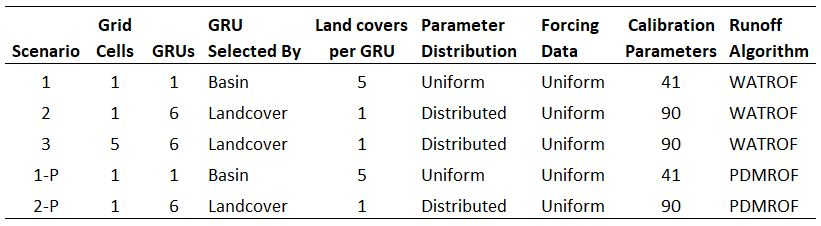
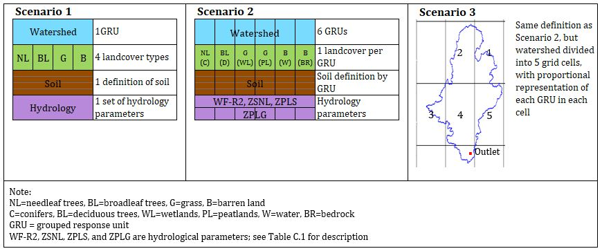

# Model Scenarios

There were a total of 5 scenarios evaluated during this project:

- Scenario_1 considered the basin to contain one GRU - meaning that the entire watershed is assumed to behave hydrologically similar. This GRU contained five landcover types based on the CLASS parameterization (Verseghy, 2012). The land cover types defined in Spence and Hedstrom (2018) were used, with the CLASS landcover type "grass" being used to define wetlands and peatlands, and the "barren land" type being used to define open water and exposed bedrock areas.
- In Scenario_2, the basin was divided into 6 GRUs defined by landcover type, with the vegetation, surface, hydrology, and soils parameterized individually for each GRU.
- In Scenario_3, the parameterization was the same as for Scenario 2 but the watershed was divided into five grid cells with tiles in each cell representing the a portion of each GRU. This configuration was chosen as it was the next logical step in increasing the complexity of the model configuration.
- Scenarios_1-P and 2-P were parameterized the same as Scenarios 1 and 2, respectively, except that parameters for WATROF were replaced with those for PDMROF (Mekonnen et al., 2014; University of Saskatchewan, 2019a). It was hypothesized that due to the large number of lakes, dominance of large lakes, and fill-and-spill nature of the basin, PDMROF may improve the predictive power of the model.

Calibration was performed using Ostrich on the University of Saskatchewan Plato server.

Notes:
- Will have to adjust the file paths in the "run_mesh.sh" and "submitjob.sh" files. Also, each scenario was run in a number of batches, so must adjust the trial numbers in the "submitjob.sh" file
- To avoid duplicating the same files in this folder, the driving data files used for each scenario are stored in "Data/Processed/Driving", rather than in each Scenario folder. When running the model, copy to the respective folder.
